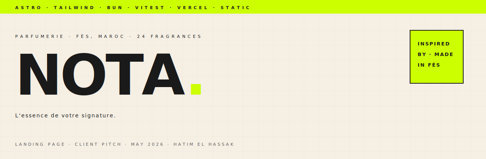

<div align="center">

<picture>
  <source media="(prefers-color-scheme: dark)" srcset="assets-readme/hero-banner-dark.svg">
  
</picture>

<br><br>

[](https://astro.build)
[](https://tailwindcss.com)
[](https://bun.sh)
[](https://vitest.dev)
[](https://vercel.com)
[](LICENSE)

<br>

_A pitch landing page for **<strong>Nota Parfum</strong>** — a **<strong>Fès-based perfume house</strong>** in Morocco that bottles **<strong>24 fragrances inspired by the great names</strong>** and delivers nationwide at **<strong>75&nbsp;MAD per flacon</strong>**. Built as an unsolicited proposal, with their actual product line, prices, reviews and brand voice baked in._

</div>

---

### `/// THE BRIEF`

```
┌────────────────────────────────────────────────────────────────────┐
│  Client     →  Nota Parfum   (@notaperfumes.official)              │
│  Location   →  Fès, Maroc                                          │
│  Catalogue  →  24 fragrances inspired-by (12 femmes · 12 hommes)   │
│  Pricing    →  75 MAD / unit · 149 MAD / 2-pack · 139 MAD / trio   │
│  Channel    →  Instagram-first, WhatsApp ordering, COD nationwide  │
│  Status     →  Pre-launch on web. No site exists.                  │
│  Goal       →  Win the gig back. Outdo the freelancer they hired.  │
└────────────────────────────────────────────────────────────────────┘
```

### `/// SECTIONS`

```
┌─ 1. HERO          → tagline · stats · hero flacon
├─ 2. MANIFESTE     → three pillars: inspiration, atelier, accessibility
├─ 3. LE RITUEL     → emerald section · 139 dh pack · 3-step process
├─ 4. LA COLLECTION → tabbed grid · Les Femmes / Les Hommes · 24 cards
├─ 5. L'ATELIER     → Fès heritage · raw materials · craft facts
├─ 6. LES AVIS      → verbatim FR + Darija reviews from IG
└─ 7. CONTACT       → WhatsApp · IG · COD · nationwide delivery
```

### `/// HIGHLIGHTS`

| Decision | Why |
|---|---|
| Tagline `L'essence de votre signature` above the fold | It's **their own** tagline, lifted verbatim from their IG menu — instant recognition. |
| French primary, Darija reviews kept verbatim | Their actual voice. *Bsahtk hbiba*, *ana ga3 mswitoni* — untranslated where the texture matters. |
| Inspired-by line on every card | Honest positioning. Beats pretending to be Maison Francis Kurkdjian. |
| Emerald "Le Rituel" section | Pulled directly from their existing teal/podium product-shot palette. |
| WhatsApp CTA in nav, hero, ritual, footer | Mirrors the real ordering path Moroccan customers use. |
| Quiet hero (no carousel, no countdown) | The Tier-1 tell. Carousels and "FLASH SALE" timers signal commodity. |
| 22 Vitest tests on data + built HTML | Catalogue integrity + brand-marker grep in CI. |

### `/// STACK`

```
Astro 5         →  static-first islands, zero JS by default
Tailwind v4     →  via @tailwindcss/vite, design tokens in @theme block
Bun 1.3         →  dev + CI runtime
Vitest 2        →  data integrity + built-HTML sanity
GitHub Actions  →  bun install · check · build · grep · test
Vercel          →  static deploy
```

### `/// PROJECT LAYOUT`

```
.
├── astro.config.mjs
├── package.json
├── tsconfig.json
├── vitest.config.ts
├── LICENSE
├── README.md
├── assets-readme/
│   ├── hero-banner.svg
│   └── hero-banner-dark.svg
├── public/
│   ├── favicon.svg
│   └── brand/                  ← cropped from their IG screenshots
│       ├── logo.png
│       ├── bottle-burberry-pair.jpg
│       ├── bottle-trio-orchard.jpg
│       ├── bottle-miss-dior-prada.jpg
│       └── bottle-pack-emerald.jpg
├── src/
│   ├── components/
│   │   ├── Nav.astro
│   │   ├── Hero.astro
│   │   ├── Manifesto.astro
│   │   ├── Ritual.astro
│   │   ├── Collection.astro
│   │   ├── FragranceCard.astro
│   │   ├── Heritage.astro
│   │   ├── Reviews.astro
│   │   └── Footer.astro
│   ├── data/
│   │   ├── fragrances.ts       ← the 24 SKUs, typed
│   │   └── reviews.ts          ← verbatim IG reviews + translations
│   ├── layouts/
│   │   └── Layout.astro
│   ├── pages/
│   │   └── index.astro
│   └── styles/
│       └── globals.css         ← tokens, fonts, btn/nav/reveal/tab primitives
├── tests/
│   ├── fragrances.test.ts      ← catalogue integrity (12 fr · 12 hm · 24 total)
│   └── build.test.ts           ← dist/index.html brand-marker assertions
└── .github/
    ├── FUNDING.yml
    └── workflows/
        └── ci.yml
```

### `/// LOCAL DEV`

```bash
bun install            # ~40s cold install
bun run dev            # http://localhost:4321
bun run check          # astro check (TS + a11y diagnostics)
bun run build          # static build → dist/
bun run preview        # serve dist/ locally
bun run test           # vitest run (data + built HTML)
```

CI runs the same commands (`bun install → check → build → grep markers → vitest`) on every push to `main` and on every PR.

### `/// STATUS`

🟢 **Production-ready static site.** Built, type-checked, tested, deployed.
Pull request workflow gates merges on the full CI suite.

---

<div align="center">

_Crafted by_ **[Hatim El Hassak](https://github.com/hatimhtm)** _in May 2026._
_Unsolicited. Honest. From one Moroccan to another._

</div>
